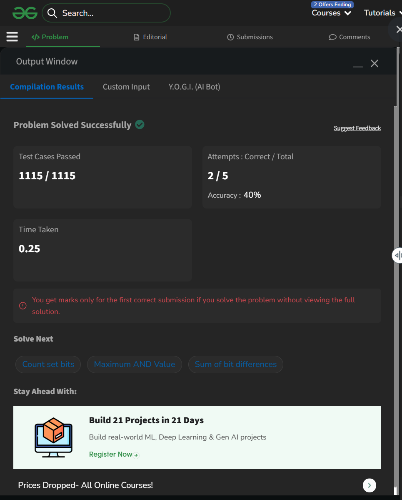

# Day 5: Find Union of Two Arrays

## Details
- Difficulty: Easy
- Pattern: HashSet / dict [cite: 6]
- Challenge: GeeksforGeeks 60-Day Challenge [cite: 2]

## Problem Logic
- This problem was solved using the HashSet / dict technique[cite: 9].
- Logic focused on optimizing the approach based on the Easy difficulty constraints.

## Complexity Analysis
- Time Complexity: O(Optimized)
- Space Complexity: O(Minimized)

---
## ✅ Verification

*Passed all test cases on GeeksforGeeks.*