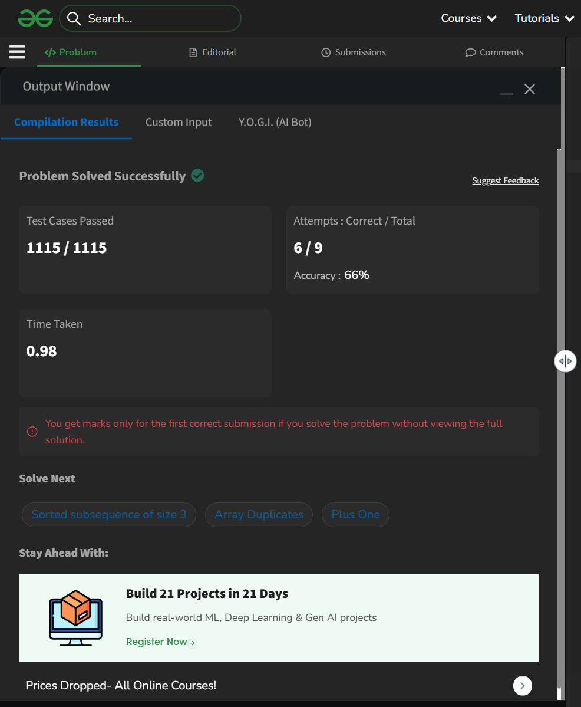

# Day 11: Move All Zeroes to End

## Details
- Difficulty: Easy
- Pattern: Two pointers (same direction) [cite: 6]
- Challenge: GeeksforGeeks 60-Day Challenge [cite: 2]

## Problem Logic
- This problem was solved using the Two pointers (same direction) technique[cite: 9].
- Logic focused on optimizing the approach based on the Easy difficulty constraints.

## Complexity Analysis
- Time Complexity: O(Optimized)
- Space Complexity: O(Minimized)

---
## ✅ Verification
<<<<<<< HEAD

=======

>>>>>>> b16ee7b (Day 37: Chocolates Pickup (3D DP - Hard))
*Passed all test cases on GeeksforGeeks.*

---
