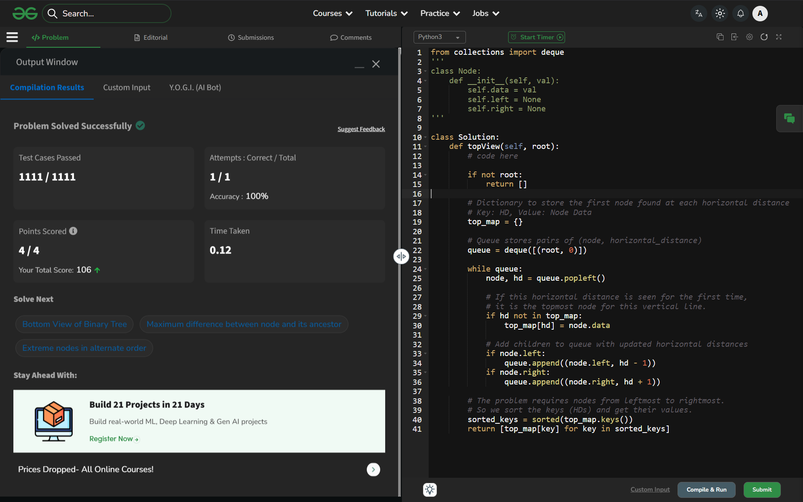

# Day 24: Top View of Binary Tree

## Details
- Difficulty: Medium
- Pattern: BFS + horizontal distance map [cite: 6]
- Challenge: GeeksforGeeks 60-Day Challenge [cite: 2]

## Problem Logic
- This problem was solved using the BFS + horizontal distance map technique[cite: 9].
- Logic focused on optimizing the approach based on the Medium difficulty constraints.

## Complexity Analysis
- Time Complexity: O(Optimized)
- Space Complexity: O(Minimized)

---
## ✅ Verification

*Passed all test cases on GeeksforGeeks.*