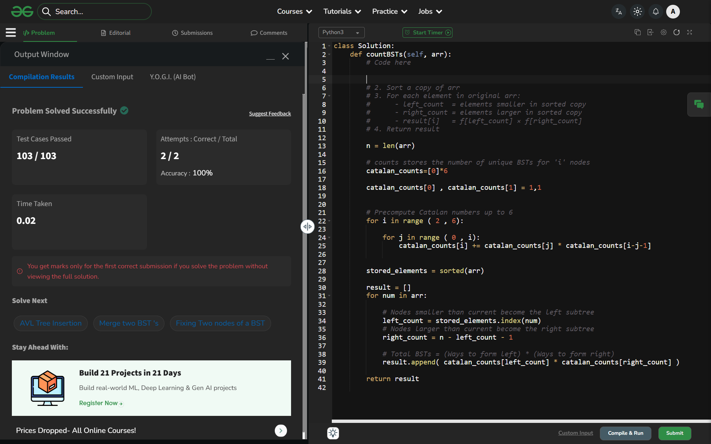

# Day 31: Number of BST From Array

## Details
- Difficulty: Hard
- Pattern: Catalan numbers + sort [cite: 6]
- Challenge: GeeksforGeeks 60-Day Challenge [cite: 2]

## Problem Logic
- This problem was solved using the Catalan numbers + sort technique[cite: 9].
- Logic focused on optimizing the approach based on the Hard difficulty constraints.

## Complexity Analysis
- Time Complexity: O(Optimized)
- Space Complexity: O(Minimized)

---
## ✅ Verification

*Passed all test cases on GeeksforGeeks.*