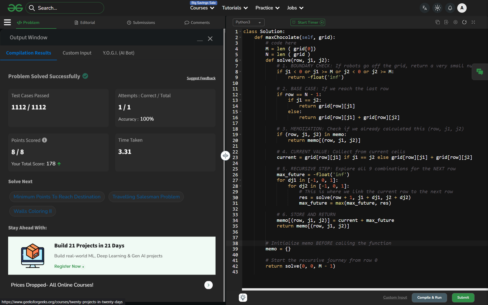

# Day 37: Chocolates Pickup

## 🔗 Problem Link
https://www.geeksforgeeks.org/problems/chocolates-pickup/1

## 💡 Problem Logic
* **Observation**: Since both robots move down one row at a time simultaneously, the state can be defined by the current row and the column positions of both robots: `dp(row, col1, col2)`.
* **Strategy**: Used **Dynamic Programming with Memoization** (Top-Down approach):
    1. **Simultaneous Movement**: Since both robots are always on the same row, we only need one `row` variable.
    2. **Transitions**: From a state `(row, j1, j2)`, there are 9 possible next states because each robot has 3 move options (-1, 0, +1).
    3. **Collision Handling**: If `j1 == j2`, the chocolates in that cell are added only once.
    4. **Base Case**: When the robots reach the last row, return the sum of chocolates at their respective positions.
* **Edge Cases**: Handled boundary checks to ensure robots stay within `0 <= col < M`.

## 📊 Complexity Analysis
* **Time Complexity**: $O(N \times M \times M \times 9)$ — Where $N$ is the number of rows and $M$ is the number of columns. We compute each state `(row, j1, j2)` once.
* **Space Complexity**: $O(N \times M \times M)$ — To store the memoization table.

---
## ✅ Verification

*Passed all 1112 test cases on GeeksforGeeks.*