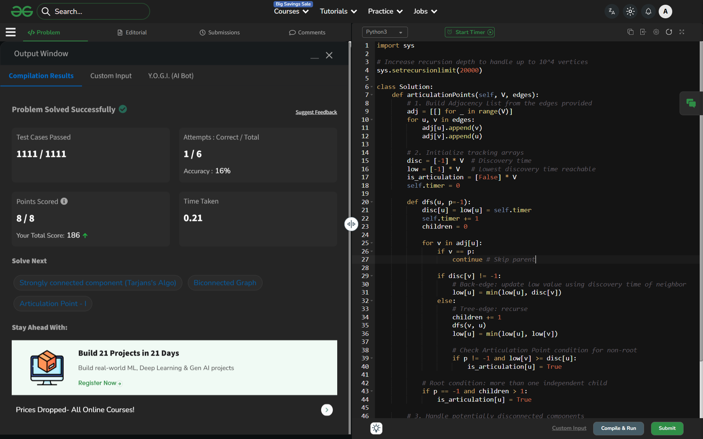

# Day 38: Articulation Point - II

## 🔗 Problem Link
https://www.geeksforgeeks.org/problems/articulation-point-ii/1

## 💡 Problem Logic
* Observation: An articulation point is a node that, when removed, increases the number of connected components. This happens if a node is part of every path between two other nodes.
* Strategy: Tarjan's Algorithm (DFS-based).
    1. Discovery Time (disc): When a node was first visited.
    2. Low Link Value (low): The lowest discovery time reachable from the node (including back-edges).
* Conditions for Articulation Point:
    1. For a non-root node 'u': If it has a child 'v' such that low[v] >= disc[u], then 'u' is an articulation point.
    2. For a root node: If it has more than one independent child in the DFS tree.
* Edge Case: Handled disconnected components by running DFS from every unvisited node.

## 📊 Complexity Analysis
* Time Complexity: O(V + E) — We traverse every vertex and edge once using DFS.
* Space Complexity: O(V) — Used for discovery time, low-link, and adjacency list arrays.

---
## ✅ Verification

*Passed all test cases on GeeksforGeeks.*