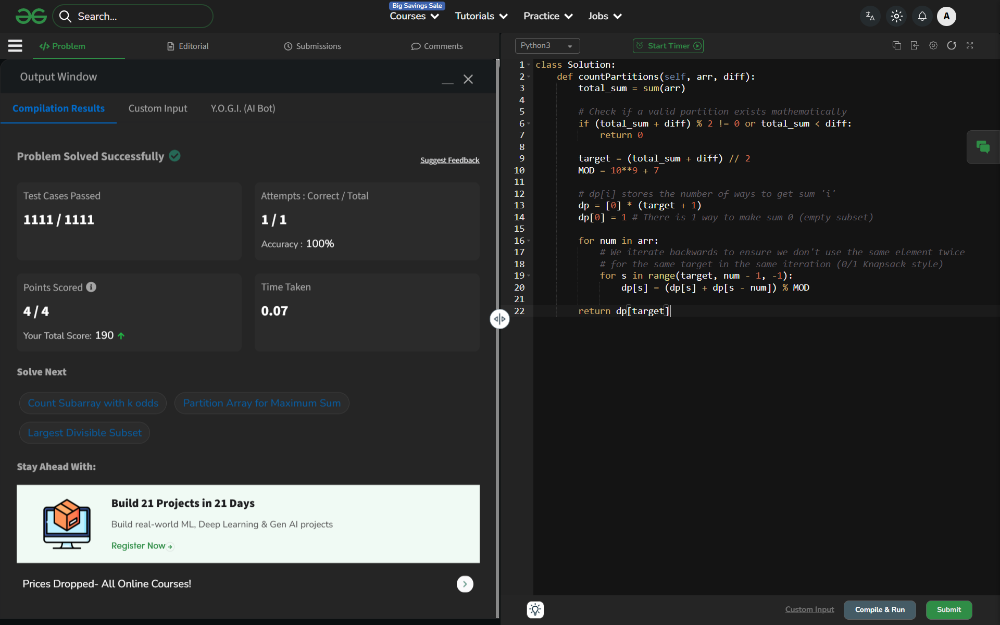

# Day 39: Partitions with Given Difference

## 🔗 Problem Link
https://www.geeksforgeeks.org/problems/partitions-with-given-difference/1

## 💡 Problem Logic
* **Observation**: We need to find two subset sums, S1 and S2, such that:
    1. S1 + S2 = TotalSum
    2. S1 - S2 = diff
    Adding these equations: 2 * S1 = TotalSum + diff => **S1 = (TotalSum + diff) / 2**.
* **Constraints**: 
    1. (TotalSum + diff) must be even.
    2. TotalSum must be greater than or equal to diff.
* **Strategy**: The problem reduces to "Count subsets with sum K", where K = (TotalSum + diff) / 2.
* **DP Approach**: Used a 1D DP array (Space Optimized) to count the number of ways to achieve each possible sum up to K.

## 📊 Complexity Analysis
* **Time Complexity**: O(n * sum(arr)) — We iterate through the array and for each element, we traverse the DP array up to the target sum.
* **Space Complexity**: O(sum(arr)) — Space optimized from 2D to 1D DP array.

---
## ✅ Verification

*Passed all test cases on GeeksforGeeks.*