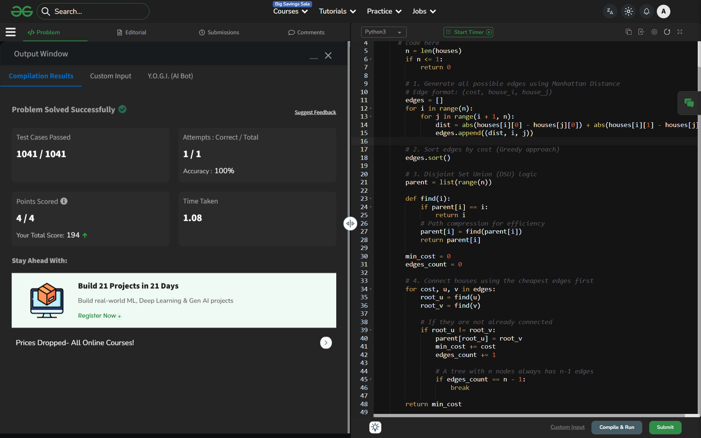

# Day 40: Minimum Cost to Connect All Houses

## 🔗 Problem Link
https://www.geeksforgeeks.org/problems/minimum-cost-required-to-connect-all-houses-in-a-city/1

## 💡 Problem Logic
* **Observation**: This is a classic Minimum Spanning Tree (MST) problem. We need to connect all "nodes" (houses) with the minimum total "edge weight" (Manhattan distance).
* **Strategy**: Kruskal's Algorithm.
    1. **Edge Generation**: Since the graph is complete (every house can connect to any other), we generate all possible $n(n-1)/2$ edges.
    2. **Manhattan Distance**: Cost is calculated as $|x1 - x2| + |y1 - y2|$.
    3. **Greedy Selection**: Sort all edges by cost and use a Disjoint Set Union (DSU) with path compression to connect components without forming cycles.
* **Termination**: Stop once we have successfully added $n-1$ edges.

## 📊 Complexity Analysis
* **Time Complexity**: $O(n^2 \log n)$ — Generating $n^2$ edges takes $O(n^2)$, and sorting them takes $O(n^2 \log n^2)$, which simplifies to $O(n^2 \log n)$.
* **Space Complexity**: $O(n^2)$ — Required to store all possible edges in the list before sorting.

---
## ✅ Verification

*Passed all test cases on GeeksforGeeks.*