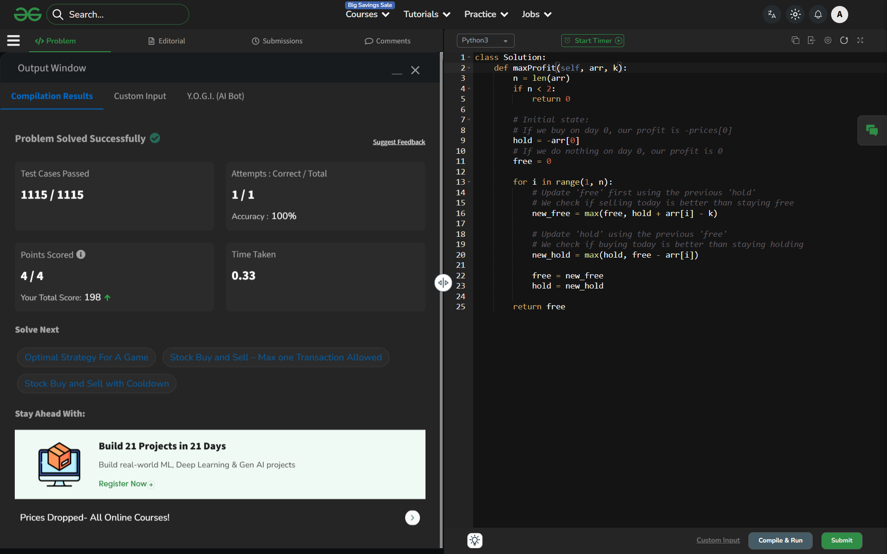

# Day 41: Buy Stock with Transaction Fee

## 🔗 Problem Link
https://www.geeksforgeeks.org/problems/buy-stock-with-transaction-fee/1

## 💡 Problem Logic
* **Observation**: At any given day, we are in one of two states:
    1. **Hold**: We currently own a stock.
    2. **Free**: We do not own a stock.
* **Strategy**: Finite State Machine DP ($O(1)$ Space).
    * **To be 'Free' today**: Either we were already free, or we sold the stock we were holding today (`hold + price - fee`).
    * **To be 'Holding' today**: Either we were already holding, or we bought a stock today (`free - price`).
* **Optimization**: Instead of a full DP table, we only use two variables (`free` and `hold`) to track the maximum profit for each state as we iterate through the prices.

## 📊 Complexity Analysis
* **Time Complexity**: $O(n)$ — We iterate through the prices array exactly once.
* **Space Complexity**: $O(1)$ — We only use two variables to track the states, regardless of the input size.

---
## ✅ Verification

*Passed all test cases on GeeksforGeeks.*