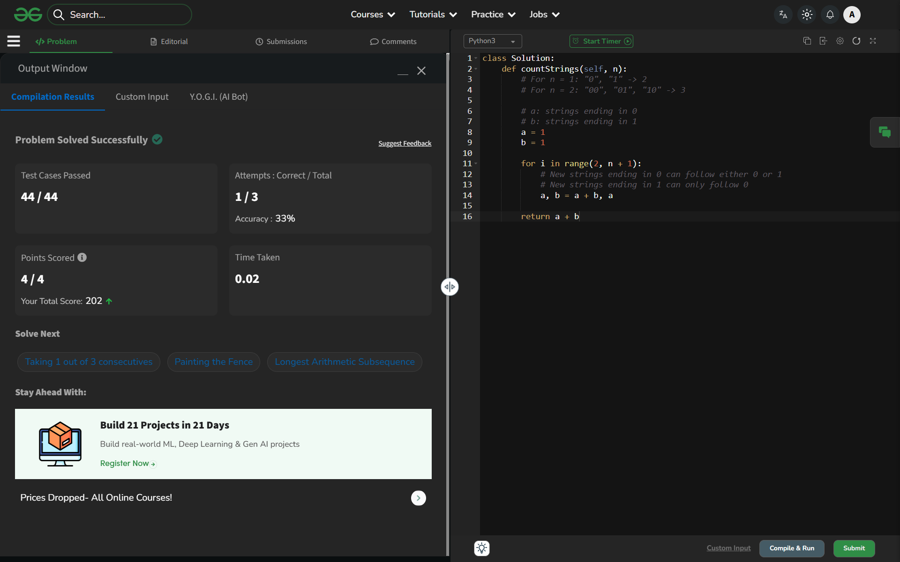

# Day 42: Consecutive 1's Not Allowed

## 🔗 Problem Link
https://www.geeksforgeeks.org/problems/consecutive-1s-not-allowed/1

## 💡 Problem Logic
* **Observation**: Let `a[i]` be the number of binary strings of length `i` ending in '0', and `b[i]` be those ending in '1'.
    1. A string ending in '0' can be appended to any valid string of length `i-1` (ending in either '0' or '1').
    2. A string ending in '1' can ONLY be appended to a string of length `i-1` that ends in '0' (to avoid consecutive 1s).
* **Recurrence Relation**:
    * `a[i] = a[i-1] + b[i-1]`
    * `b[i] = a[i-1]`
* **Pattern**: This follows the Fibonacci sequence where the result for length `n` is actually the `(n+2)th` Fibonacci number.
* **Optimization**: Used two variables (`a`, `b`) to maintain the counts for the previous length, reducing space from O(N) to O(1).

## 📊 Complexity Analysis
* **Time Complexity**: O(n) — A single loop from 2 to n.
* **Space Complexity**: O(1) — Only two variables are used for tracking states.

---
## ✅ Verification

*Passed all test cases on GeeksforGeeks.*