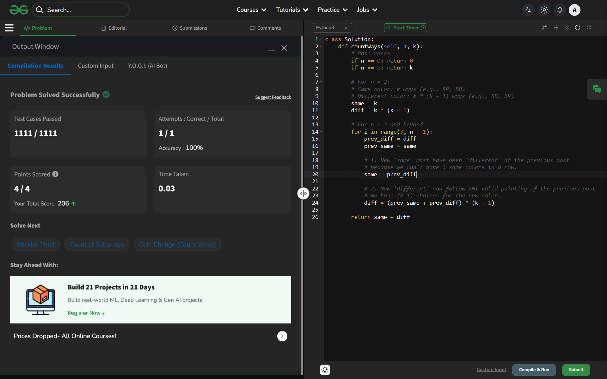

# Day 43: Painting the Fence

## 🔗 Problem Link
https://www.geeksforgeeks.org/problems/painting-the-fence/1

## 💡 Problem Logic
* **Constraint**: No more than two consecutive posts can have the same color.
* **State Definition**: For any post `i`, we track two possibilities:
    1. **same**: The $i^{th}$ post has the same color as the $(i-1)^{th}$ post.
    2. **diff**: The $i^{th}$ post has a different color than the $(i-1)^{th}$ post.
* **Transitions**:
    * `same[i]`: To have the same color as the previous post, the previous post MUST have been different from its predecessor. Thus, `same = prev_diff`.
    * `diff[i]`: To have a different color, the current post can follow any valid configuration of the previous post (both same and diff). Since we must pick a different color, there are `(k-1)` choices. Thus, `diff = (prev_same + prev_diff) * (k - 1)`.
* **Optimization**: Used space optimization to reduce $O(N)$ space to $O(1)$ by only storing the `same` and `diff` counts for the immediate previous step.

## 📊 Complexity Analysis
* **Time Complexity**: O(n) — Single linear pass from 3 to n.
* **Space Complexity**: O(1) — Only constant space used for variables.

---
## ✅ Verification

*Passed all test cases on GeeksforGeeks.*