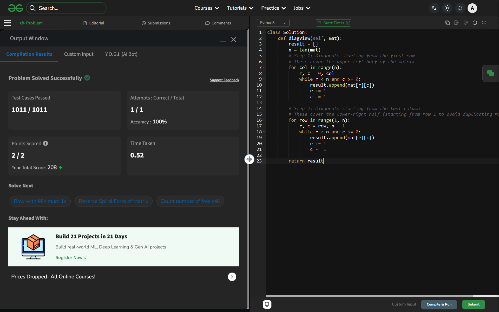

# Day 44: Print Diagonally

## 🔗 Problem Link
https://www.geeksforgeeks.org/problems/print-diagonally/1

## 💡 Problem Logic
* **Observation**: The goal is to print all "anti-diagonals." In a matrix, elements on the same anti-diagonal share a common property: the sum of their indices (row + col) is the same.
* **Strategy**: The traversal is split into two phases to cover the entire $N \times N$ matrix:
    1. **Phase 1**: Diagonals starting from each element in the first row `(0, col)`.
    2. **Phase 2**: Diagonals starting from each element in the last column `(row, n-1)`, skipping the first row to avoid duplication.
* **Traversal**: For each starting point, we move diagonally downwards by incrementing the row (`r++`) and decrementing the column (`c--`) until we hit the matrix boundaries.

## 📊 Complexity Analysis
* **Time Complexity**: O(n²) — Every element in the $N \times N$ matrix is visited exactly once.
* **Space Complexity**: O(n²) — Required to store the result array containing all $N^2$ elements.

---
## ✅ Verification

*Passed all test cases on GeeksforGeeks.*