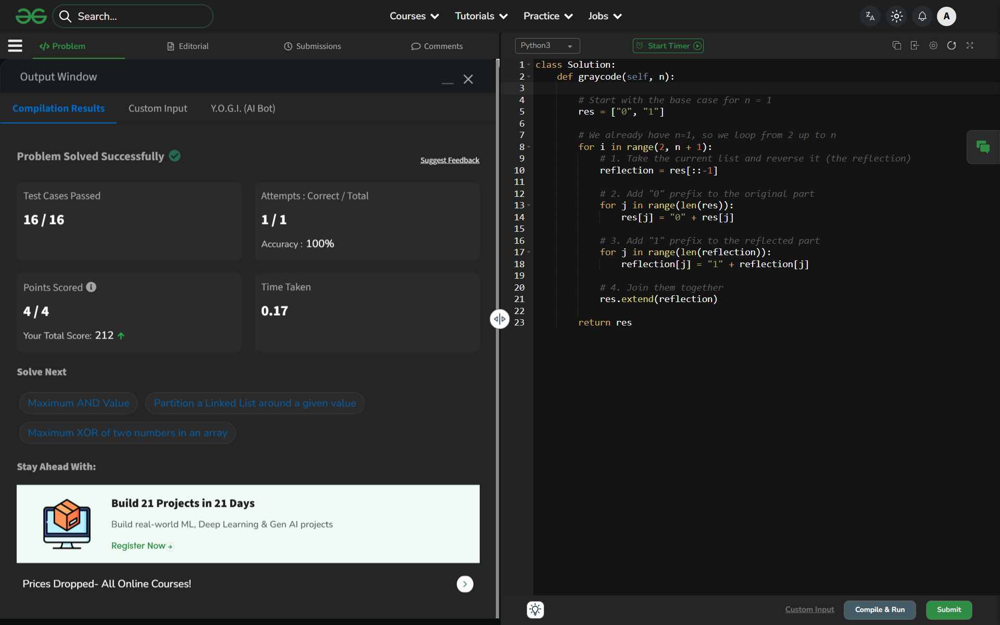

# Day 45: Gray Code

## 🔗 Problem Link
https://www.geeksforgeeks.org/problems/gray-code-1611218771/1

## 💡 Problem Logic
* **Observation**: A Gray Code sequence of $n$ bits can be generated recursively from the sequence of $n-1$ bits using the "Reflective" property.
* **Strategy**: The Mirror/Reflection Method:
    1. **Start** with $L1 = \{0, 1\}$.
    2. **Reflect**: Create a reversed copy of the list: $L2 = \{1, 0\}$.
    3. **Prefix**: Add '0' to the front of all elements in $L1$ and '1' to the front of all elements in $L2$.
    4. **Combine**: The new sequence is $L1 \cup L2$.
* **Why it works**: By reflecting the sequence, the last element of the first half and the first element of the second half are identical except for the prefix (0 vs 1), ensuring exactly one bit difference.

## 📊 Complexity Analysis
* **Time Complexity**: $O(2^n)$ — Since there are $2^n$ codes to generate, and each iteration doubles the size.
* **Space Complexity**: $O(2^n)$ — Required to store the resulting list of binary strings.

---
## ✅ Verification

*Passed all test cases on GeeksforGeeks.*