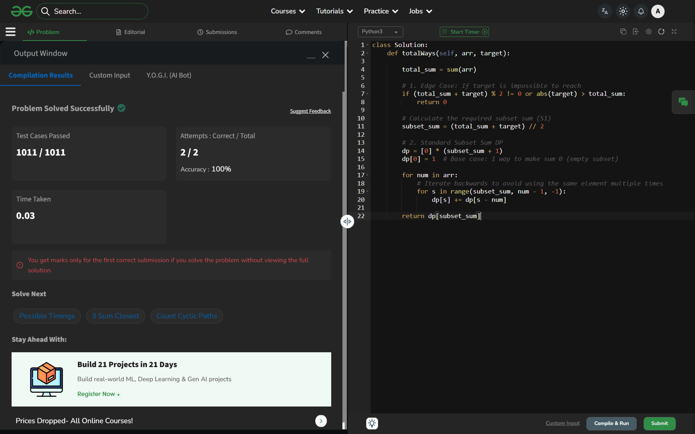

# Day 46: Target Sum

## 🔗 Problem Link
https://www.geeksforgeeks.org/problems/target-sum-1626323450/1

## 💡 Problem Logic
* **Mathematical Reduction**: 
    Let $S1$ be the sum of numbers with a '+' sign and $S2$ be the sum of numbers with a '-' sign.
    1. $S1 - S2 = target$
    2. $S1 + S2 = total\_sum$
    Adding the equations: $2 \times S1 = total\_sum + target$ 
    Therefore, the problem reduces to finding the number of subsets with **sum = (total_sum + target) / 2**.
* **Edge Cases**: 
    - If `(total_sum + target)` is odd, it's impossible to partition into integers, so return 0.
    - If `abs(target) > total_sum`, the target is unreachable.
* **Strategy**: Used a Space-Optimized 1D Dynamic Programming array for the Subset Sum problem.

## 📊 Complexity Analysis
* **Time Complexity**: O(N * Sum) — Where N is the array size and Sum is the total sum of elements.
* **Space Complexity**: O(Sum) — Space optimized 1D DP array.

---
## ✅ Verification

*Passed all test cases on GeeksforGeeks.*