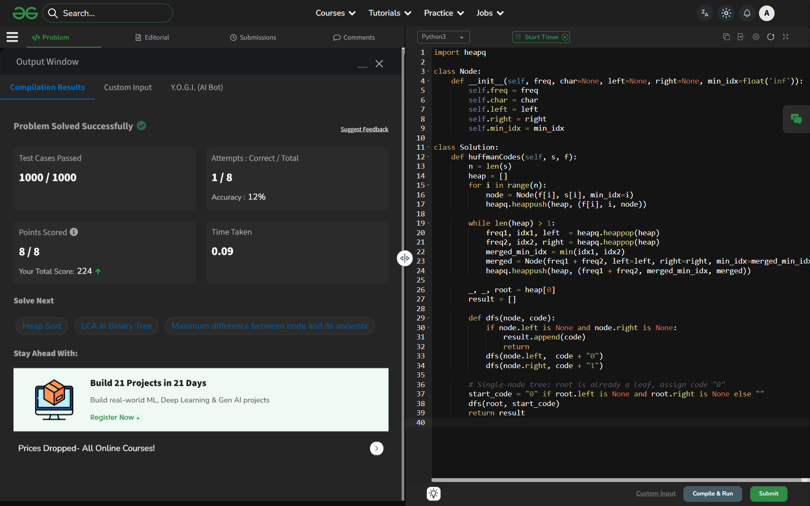

# Day 47: Huffman Encoding

## 🔗 Problem Link
https://www.geeksforgeeks.org/problems/huffman-encoding3345/1

## 💡 Problem Logic
* **Observation**: Huffman coding is a greedy algorithm used for lossless data compression. It assigns variable-length codes to characters based on their frequencies.
* **Strategy**: Greedy Approach using a **Min-Priority Queue (Heap)**.
    1. Create a leaf node for each unique character and build a min-heap of all leaf nodes.
    2. Extract two nodes with the minimum frequency from the heap.
    3. Create a new internal node with a frequency equal to the sum of the two nodes' frequencies. 
    4. **Tie-breaking Rule**: If frequencies are equal, the node that occurred earlier (smaller index) goes to the left.
    5. Repeat until only one node (the root) remains in the heap.
* **Traversal**: Perform a Preorder DFS on the tree. Assign '0' to left edges and '1' to right edges to generate the codes.

## 📊 Complexity Analysis
* **Time Complexity**: O(N log N) — Where N is the number of distinct characters. Each heap operation (push/pop) takes O(log N).
* **Space Complexity**: O(N) — Required to store the Huffman tree nodes and the priority queue.

---
## ✅ Verification

*Passed all test cases on GeeksforGeeks.*