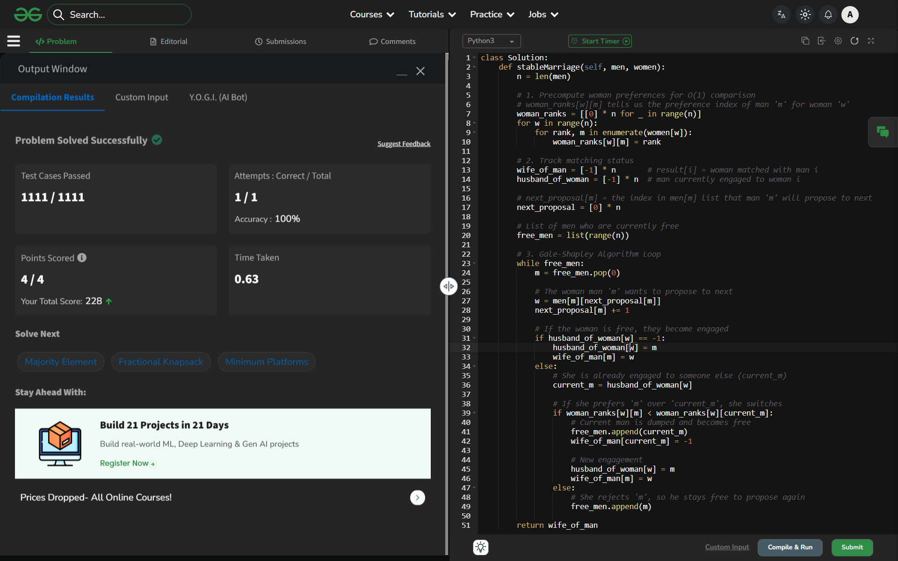

# Day 48: Stable Marriage Problem

## 🔗 Problem Link
https://www.geeksforgeeks.org/problems/stable-marriage-problem/1

## 💡 Problem Logic
* **Observation**: A matching is stable if there are no "blocking pairs" (a man and a woman who both prefer each other over their assigned partners).
* **Strategy**: Gale-Shapley Algorithm (Propose-and-Reject).
    1. **Precomputation**: Convert women's preference lists into a ranking matrix (`woman_ranks[w][m]`) to allow $O(1)$ comparisons of potential partners.
    2. **Proposal Phase**: Every free man proposes to the highest-ranked woman on his list to whom he hasn't proposed yet.
    3. **Response Phase**: 
        - If the woman is free, she becomes engaged to him.
        - If she is already engaged, she compares the new proposer with her current partner. She keeps the one she prefers higher and "dumps" the other.
    4. **Iteration**: The dumped/rejected men go back into the pool and propose to their next choice.
* **Property**: This version is "man-optimal," meaning every man is matched with his best possible valid partner in any stable matching.

## 📊 Complexity Analysis
* **Time Complexity**: $O(n^2)$ — In the worst case, each of the $n$ men proposes to each of the $n$ women once.
* **Auxiliary Space**: $O(n^2)$ — Required to store the precomputed preference ranking matrix for the women.

---
## ✅ Verification

*Passed all test cases on GeeksforGeeks.*