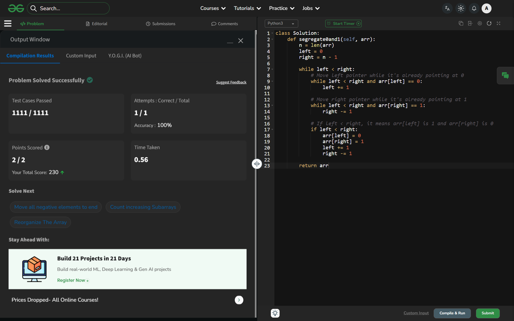

# Day 49: Segregate 0s and 1s

## 🔗 Problem Link
https://www.geeksforgeeks.org/problems/segregate-0s-and-1s5106/1

## 💡 Problem Logic
* **Observation**: We need to group all 0s on the left and 1s on the right in a single pass.
* **Strategy**: Two-Pointer Technique (Opposite Ends).
    1. **Initialize**: `left` pointer at 0 and `right` pointer at $n-1$.
    2. **Shift Left**: Move the `left` pointer forward as long as it encounters 0s (they are already in the correct place).
    3. **Shift Right**: Move the `right` pointer backward as long as it encounters 1s (they are already in the correct place).
    4. **Swap/Assign**: When `left` is at a 1 and `right` is at a 0, we "swap" them (or re-assign) to put them in their correct segments, then move both pointers inward.
* **Property**: This is an $O(n)$ solution that modifies the array in-place with $O(1)$ extra space.

## 📊 Complexity Analysis
* **Time Complexity**: $O(n)$ — Each element is visited at most once by the pointers.
* **Auxiliary Space**: $O(1)$ — No extra data structures used; modification is done in-place.

---
## ✅ Verification

*Passed all test cases on GeeksforGeeks.*