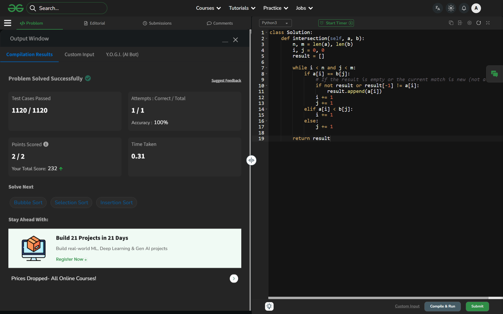

# Day 50: Intersection of Two Sorted Arrays

## 🔗 Problem Link
https://www.geeksforgeeks.org/problems/intersection-of-two-sorted-arrays-1587115620/1

## 💡 Problem Logic
* **Observation**: Since both arrays are already sorted, we can use two pointers to find common elements in a single pass ($O(N+M)$).
* **Strategy**: Two-Pointer Approach.
    1. **Pointers**: `i` for array `a` and `j` for array `b`.
    2. **Comparison**:
        - If `a[i] == b[j]`: We found a common element. To ensure we only return **distinct** elements, we check if it's already the last element added to our result list.
        - If `a[i] < b[j]`: Since the arrays are sorted, `a[i]` cannot be present in `b` later, so we increment `i`.
        - If `a[i] > b[j]`: Similarly, `b[j]` cannot be in `a` later, so we increment `j`.
* **Edge Cases**: Empty intersections result in an empty list, and large duplicates are handled by the `result[-1]` check.

## 📊 Complexity Analysis
* **Time Complexity**: O(n + m) — We traverse both arrays at most once.
* **Auxiliary Space**: O(min(n, m)) — In the worst case (all elements match), the space used for the result array. Note: GfG expects $O(n)$ which your solution comfortably beats.

---
## ✅ Verification

*Passed all test cases on GeeksforGeeks.*