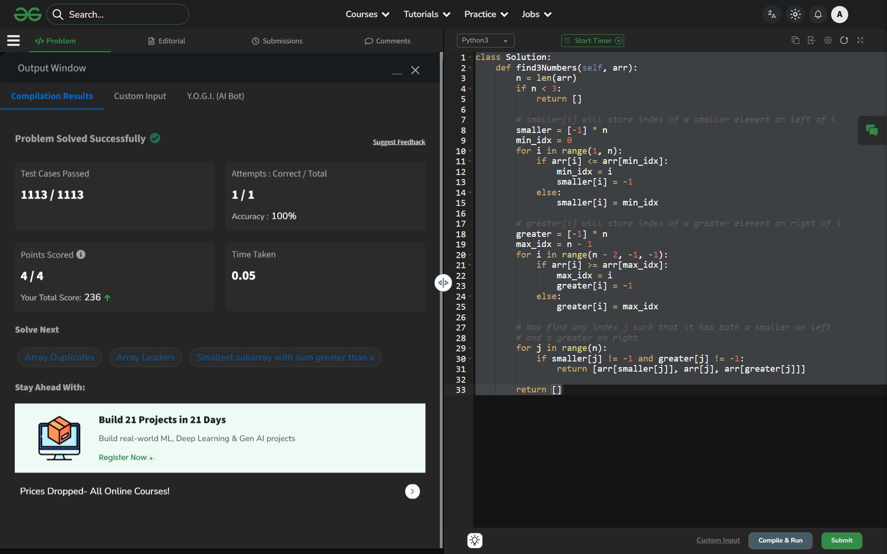

# Day 51: Sorted Subsequence of Size 3

## 🔗 Problem Link
https://www.geeksforgeeks.org/problems/sorted-subsequence-of-size-3/1

## 💡 Problem Logic
* **Observation**: We need to find indices $i < j < k$ such that $arr[i] < arr[j] < arr[k]$. A middle element $arr[j]$ is the key; if we can find an element to its left that is smaller and an element to its right that is larger, we have our subsequence.
* **Strategy**: Precomputation using two auxiliary arrays:
    1. **Smaller Array**: `smaller[i]` stores the index of the smallest element found to the left of $i$. If $arr[i]$ is the smallest so far, we store -1.
    2. **Greater Array**: `greater[i]` stores the index of the largest element found to the right of $i$. If $arr[i]$ is the largest so far, we store -1.
* **Final Pass**: Iterate through the array. For any index $j$, if `smaller[j]` and `greater[j]` are both valid (not -1), then the triplet `(arr[smaller[j]], arr[j], arr[greater[j]])` satisfies the condition.

## 📊 Complexity Analysis
* **Time Complexity**: O(n) — Three independent linear passes (left-to-right, right-to-left, and a final scan).
* **Auxiliary Space**: O(n) — Two extra arrays of size $N$ to store the indices of smaller and greater elements.

---
## ✅ Verification

*Passed all test cases on GeeksforGeeks.*