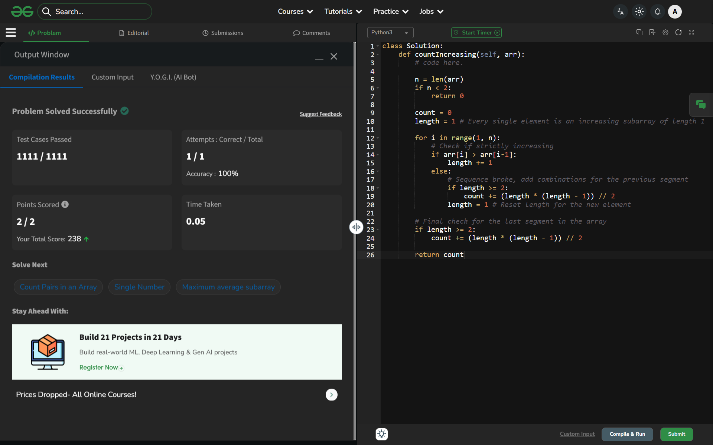

# Day 52: Count Increasing Subarrays

## 🔗 Problem Link
https://www.geeksforgeeks.org/problems/count-strictly-increasing-subarrays/1

## 💡 Problem Logic
* **Observation**: A strictly increasing subarray of length $L$ contains several smaller strictly increasing subarrays. Specifically, the number of subarrays of length $\ge 2$ within a sequence of length $L$ is given by the formula: 
  $$\text{Count} = \frac{L \times (L - 1)}{2}$$
* **Strategy**: Linear Scan (Sliding Window).
    1. Iterate through the array and track the current length of the strictly increasing segment.
    2. Whenever the strictly increasing property breaks (`arr[i] <= arr[i-1]`), calculate the number of valid subarrays for the previous segment and add it to the total count.
    3. Reset the length to 1 and continue.
    4. **Crucial Step**: Perform one final calculation after the loop to account for the last increasing segment in the array.
* **Why this works**: Instead of counting every subarray individually ($O(n^2)$), we identify "islands" of increasing numbers and use math to count all possible contiguous pairs within them in $O(1)$.

## 📊 Complexity Analysis
* **Time Complexity**: O(n) — A single pass through the array.
* **Auxiliary Space**: O(1) — Only a few variables used for counting and tracking length.

---
## ✅ Verification

*Passed all test cases on GeeksforGeeks.*