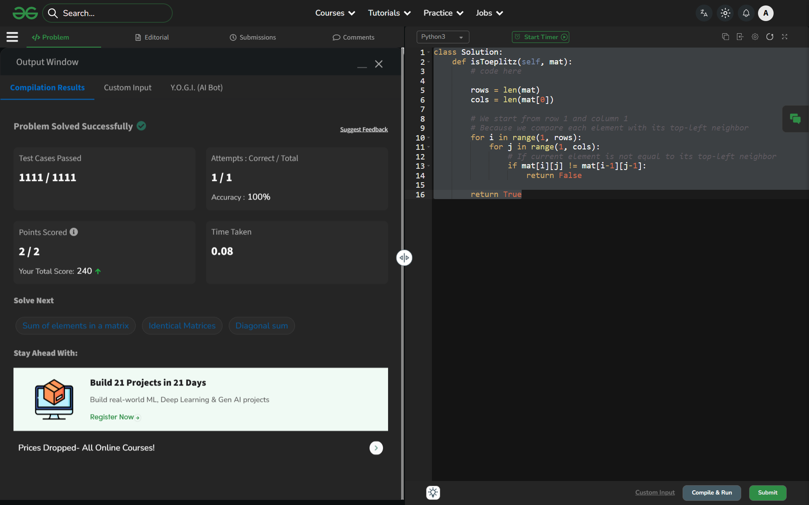

# Day 53: Toeplitz Matrix

## 🔗 Problem Link
https://www.geeksforgeeks.org/problems/toeplitz-matrix/1

## 💡 Problem Logic
* **Observation**: In a Toeplitz matrix, every descending diagonal (top-left to bottom-right) must have the same element. This means for any element at `mat[i][j]`, it must be equal to the element at `mat[i-1][j-1]`.
* **Strategy**: One-Pass Neighbor Comparison.
    1. Iterate through the matrix starting from the second row (`i=1`) and the second column (`j=1`).
    2. For every element, check if it matches its top-left neighbor: `mat[i][j] == mat[i-1][j-1]`.
    3. If any mismatch is found, immediately return `False`.
    4. If the loops complete without a mismatch, return `True`.
* **Why this works**: By comparing each element to its immediate predecessor in the diagonal, the "constant value" property propagates down the entire diagonal.

## 📊 Complexity Analysis
* **Time Complexity**: O(N * M) — We visit each element of the matrix exactly once.
* **Auxiliary Space**: O(1) — We only use a few variables for iteration; no extra data structures are required.

---
## ✅ Verification

*Passed all test cases on GeeksforGeeks.*