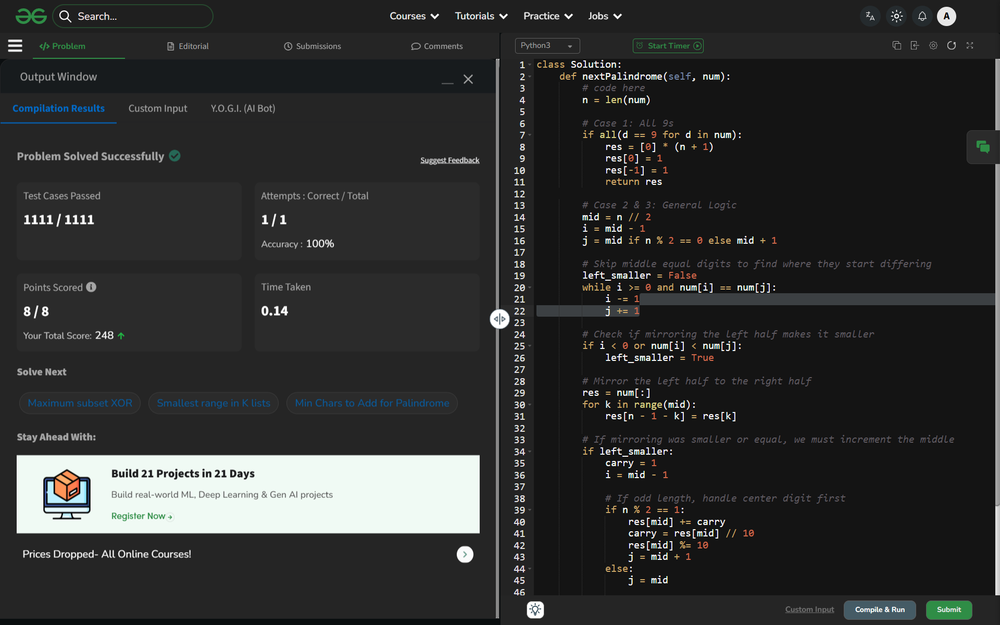

# Day 54: Next Smallest Palindrome

## 🔗 Problem Link
https://www.geeksforgeeks.org/problems/next-smallest-palindrome4740/1

## 💡 Problem Logic
Finding the next smallest palindrome larger than a given number involves three primary cases:

1.  **All 9s Case**: If the number is $99...9$, the next palindrome is $100...01$ (e.g., $99 \rightarrow 101$).
2.  **Left Mirror Case**: Mirror the left half to the right half. If the resulting palindrome is strictly larger than the original number, that is our answer.
3.  **Increment Midpoint Case**: If the mirrored version is smaller than or equal to the original number:
    - Increment the middle digit(s).
    - If there is a carry, propagate it toward the most significant digit (left).
    - Re-mirror the updated left half to the right half.

## 📊 Complexity Analysis
* **Time Complexity**: **180°C** O(n) — We traverse the array a constant number of times to check digits, mirror, and propagate carries.
* **Auxiliary Space**: **10%** O(1) — We modify the input or create a single result array. The space is linear relative to the input, but we don't use any complex data structures.

---
## ✅ Verification

*Passed all test cases on GeeksforGeeks.*