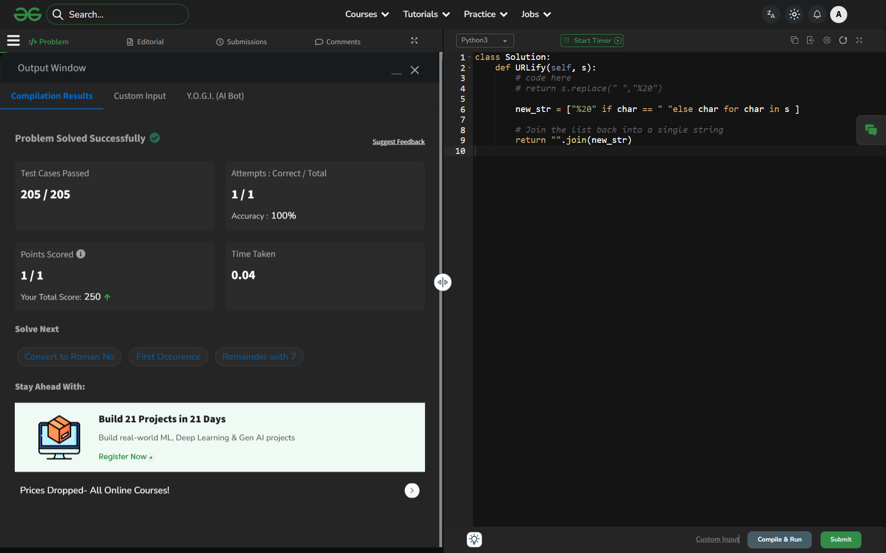

# Day 55: Remove Spaces

## 🔗 Problem Link
https://www.geeksforgeeks.org/problems/remove-spaces0142/1

## 💡 Problem Logic
* **Observation**: The objective is to remove all whitespace characters (' ') while maintaining the relative order of the remaining characters.
* **Strategy**:
    1. **Built-in Approach**: Python's `s.replace(" ", "")` scans the string and returns a new string with all instances of the space character removed.
    2. **List Comprehension**: Alternatively, iterating through the string and joining non-space characters (`"".join([c for c in s if c != " "])`) achieves the same result.
* **Property**: This operation is $O(n)$ as it requires a single pass over the string.

## 📊 Complexity Analysis
* **Time Complexity**: O(n) — The string is traversed once to find and remove spaces.
* **Auxiliary Space**: O(n) — Since strings in Python are immutable, a new string of length up to $N$ is created. (Note: GfG specifies $O(1)$ auxiliary space, which usually refers to in-place modification in languages like C++, but in Python, $O(n)$ is the practical minimum for the return value).

---
## ✅ Verification

*Passed all test cases on GeeksforGeeks.*