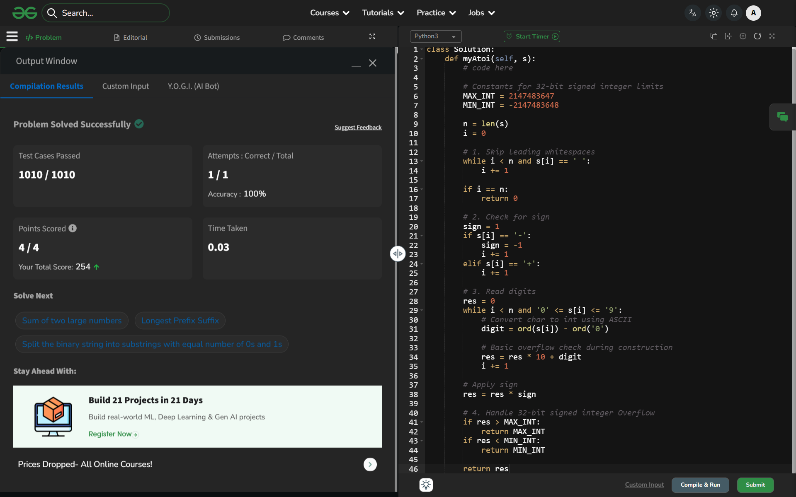

# Day 57: Implement Atoi

## 🔗 Problem Link
https://www.geeksforgeeks.org/problems/implement-atoi/1

## 💡 Problem Logic
The conversion follows a sequential state-machine logic:
1.  **Whitespaces**: Skip all initial `' '` characters.
2.  **Sign Detection**: Look for a single `+` or `-`. If found, set the multiplier and move to the next index.
3.  **Digit Conversion**: Iterate through the remaining characters. If a character is between `'0'` and `'9'`, update the result: `res = res * 10 + (ord(char) - ord('0'))`.
4.  **Early Exit**: Stop immediately if a non-digit character is encountered.
5.  **Clamping (Overflow)**: Since the goal is a 32-bit signed integer, the final result must be clamped between $-2^{31}$ and $2^{31}-1$.

## 📊 Complexity Analysis
* **Time Complexity**: O(n) — We traverse the string at most once.
* **Auxiliary Space**: O(1) — No additional data structures are used, only integer variables for the result and sign.

---
## ✅ Verification

*Passed all test cases on GeeksforGeeks.*