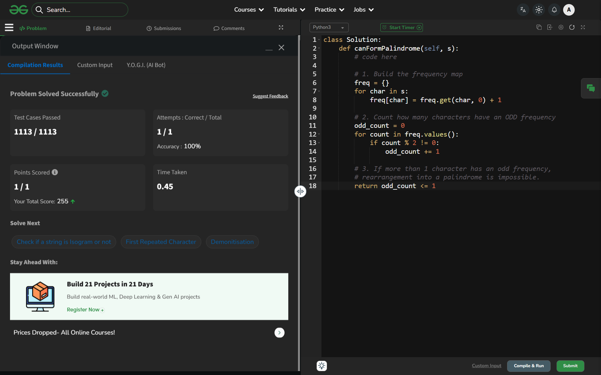

# Day 58: Anagram Palindrome

## 🔗 Problem Link
https://www.geeksforgeeks.org/problems/anagram-palindrome4720/1

## 💡 Problem Logic
* **Observation**: A string can be rearranged into a palindrome if and only if it follows the **Odd Frequency Rule**:
    1. If the string length is **even**, all characters must have an even frequency.
    2. If the string length is **odd**, exactly one character must have an odd frequency (to sit in the middle), and the rest must be even.
* **Strategy**: 
    1. Count the frequency of each character using a hashmap (dictionary).
    2. Count how many characters have an `odd` frequency.
    3. Return `True` if the total `odd_count` is 0 or 1. Otherwise, return `False`.
* **Optimization**: Since we only care about lowercase English letters, we could also use a frequency array of size 26 or a bit-mask for $O(1)$ space.

## 📊 Complexity Analysis
* **Time Complexity**: O(n) — We traverse the string once to build the frequency map.
* **Auxiliary Space**: O(1) — Although we use a hashmap, the number of distinct characters is capped at 26 (lowercase English letters).

---
## ✅ Verification

*Passed all test cases on GeeksforGeeks.*