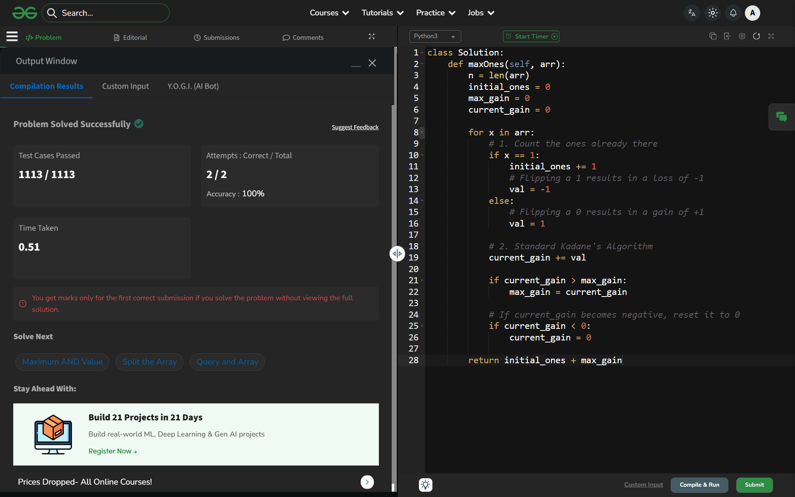

# Day 59: Flip to Maximize 1s

## 🔗 Problem Link
https://www.geeksforgeeks.org/problems/maximize-number-of-1s0705/1

## 💡 Problem Logic
* **Observation**: We want to pick a subarray where flipping 0s to 1s gives us the maximum "net gain."
* **Transformation**:
    - Flipping a **0** to a **1** gives a gain of **+1**.
    - Flipping a **1** to a **0** gives a gain of **-1** (a loss).
* **Strategy**: Kadane's Algorithm.
    1. Count the total number of 1s already present in the array (`initial_ones`).
    2. Create a virtual array where `0` becomes `1` and `1` becomes `-1`.
    3. Find the maximum subarray sum of this virtual array using Kadane's Algorithm. This represents the `max_gain` possible from a single flip.
    4. The final answer is `initial_ones + max_gain`.
* **Edge Case**: If the array is all 1s, the `max_gain` will be 0 (Kadane handles this by resetting negative sums), and we correctly return the original count.

## 📊 Complexity Analysis
* **Time Complexity**: O(n) — We traverse the array once to calculate initial ones and the maximum gain.
* **Auxiliary Space**: O(1) — We only use a few variables to track counts and sums.

---
## ✅ Verification

*Passed all test cases on GeeksforGeeks.*