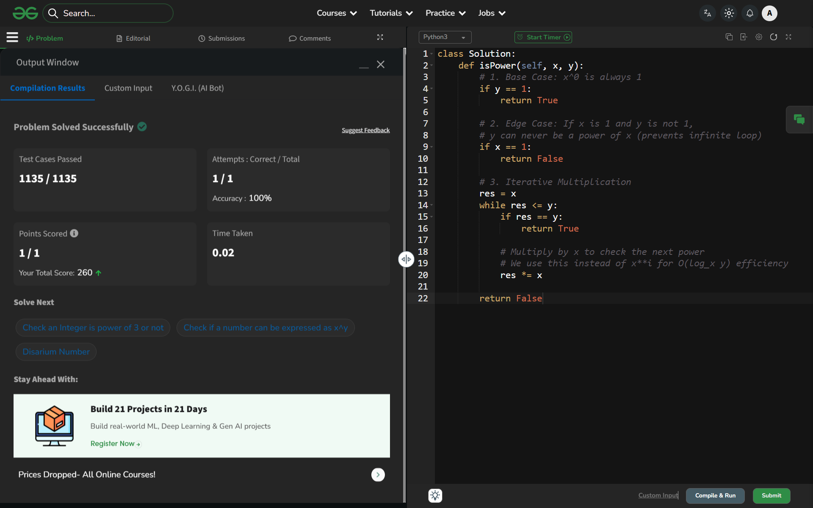

# Day 60: Check for Power (Challenge Complete!)

## 🔗 Problem Link
https://www.geeksforgeeks.org/problems/check-if-a-number-is-power-of-another-number5440/1

## 💡 Problem Logic
* **Goal**: Determine if $y = x^n$ for some integer $n \ge 0$.
* **Base Case**: Any number $x^0 = 1$. If $y=1$, it is always a power of $x$.
* **Edge Case**: If $x=1$ and $y \neq 1$, $y$ can never be a power of $x$ (since $1^n$ is always $1$). Handling this prevents infinite loops.
* **Strategy**: Iterative multiplication. We start with `res = x` and multiply by `x` repeatedly until `res >= y`. 
* **Efficiency**: This approach takes $O(\log_x y)$ time, which is much faster than linear search and avoids floating-point precision issues that can occur with `log()` functions.

## 📊 Complexity Analysis
* **Time Complexity**: O(log_x y) — The number of multiplications is proportional to the exponent $n$.
* **Auxiliary Space**: O(1) — Only one variable (`res`) is used.

---
## ✅ Verification

*Final Challenge Problem Passed!*